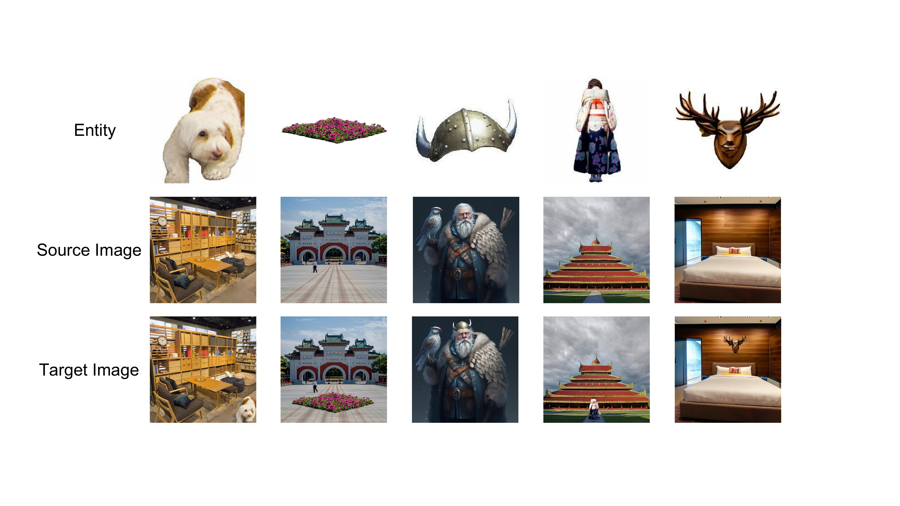
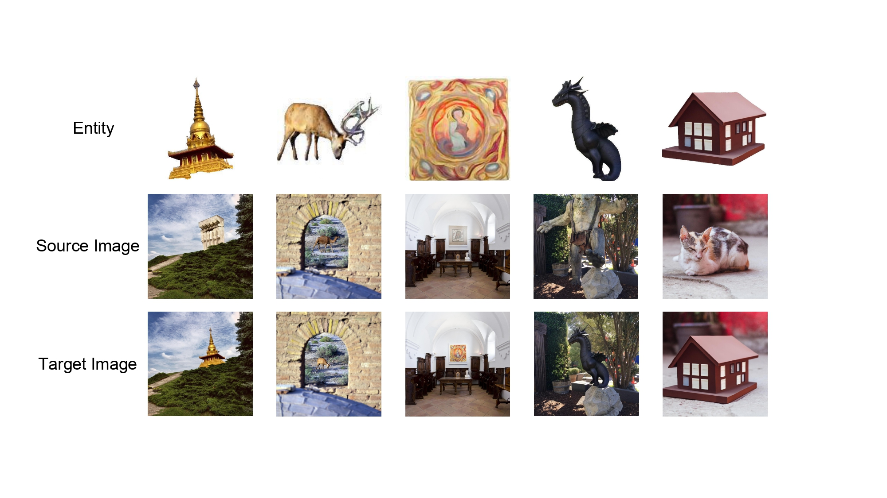
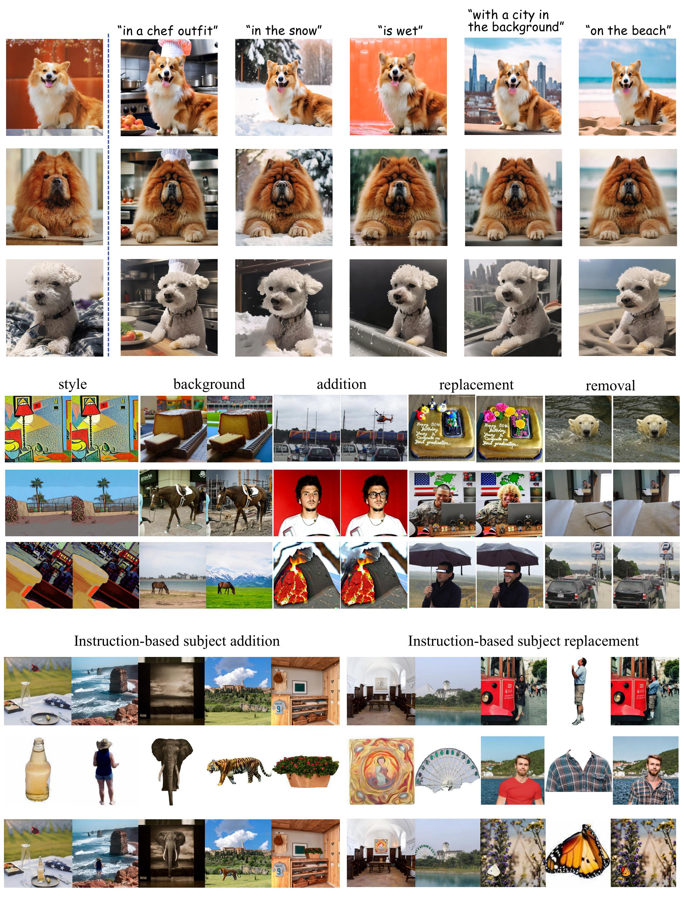

# MIGE: A Unified Framework for Multimodal Instruction-Based Image Generation and Editing
Implementation code of the paper **MIGE: A Unified Framework for Multimodal Instruction-Based Image Generation and Editing**


## Quick Start

### 1. Set Up Python Environment

We recommend using Python version 3.9.2 and setting up a virtual environment for this project.

1. **Check Python version:**
    ```bash
    python --version  # Should be Python 3.9.2
    ```

2. **Create and activate a virtual environment:**
    ```bash
    python3 -m venv mige
    source mige/bin/activate
    ```

3. **Install required dependencies:**
    ```bash
    pip install torch==2.1.1 torchvision==0.16.1 torchaudio==2.1.1 --index-url https://download.pytorch.org/whl/cu118
    cd MIGE
    pip install -r requirements.txt
    ```

### 2. Install System Libraries

If you encounter any of the following errors, you can install the required system libraries.

`ImportError: libGL.so.1: cannot open shared object file: No such file or directory`

Solution:
```bash
sudo apt-get update
sudo apt-get install -y libgl1-mesa-glx
sudo apt-get install -y libglib2.0-0
```

`OSError: libcudart.so.11.0: cannot open shared object file: No such file or directory`

Solution:
```bash
pip uninstall -y torch torchvision torchaudio
pip install --no-cache-dir torch==2.1.1 torchvision==0.16.1 torchaudio==2.1.1 --index-url https://download.pytorch.org/whl/cu118
```

## Data Format

Example data for the following types is provided in the `example_data` folder:

- `subject-driven`
- `instruction-based edit`
- `instruction-based subject-driven edit (replace)`

### Data Preprocessing

To train the model, you need to extract features using the `tools/extract_features.py`.

1. **Create separate folders** for the following entities: `vae_entity_image`, `vae_source_image`, and `vae_target_image` to store the corresponding VAE features.

2. Modify the loop `for item in items['source_path']:` (line 44) to specify the type of image being processed.

3. It is recommended to store data for different tasks in **separate JSON files**. The `example_data.json` file contains mixed data types for demonstration purposes.

## Training

We provide an `accelerate_config.yaml` file for single-node multi-GPU/multi-node multi-GPU training. After modifying the `configs/config_mige.py` file, run the training script:

```bash
sh train_scripts/train_mige.sh
```

For convenience, we have uploaded all the models mentioned in the paper, including `bert-base-uncased`, `sd-vae-ft-ema`, `t5-v1_1-xxl`, `PixArt-XL-2-512x512`, `blip2_pretrained_flant5xxl`, `eva_vit_g`, along with the final MIGE model (`model.pth`), to [Hugging Face](https://huggingface.co/EurekaTian/MIGE). Download them and put in `output/pretrained_models`.

## Inference

Inference scripts for **subject-driven image generation**, **instruction-based image editing**, and **instruction-based subject-driven image editing** are available in `MIGE/infer_scripts`. Here are some key points for performing inference:

- Replace the dataset paths in the `emuedit` dataset JSON file.
- Follow the batch size (`bs`) in the benchmark settings. The model uses `torch.randn` for initialization. Even though the seed is controlled, the latent noise used is dependent on the batch size. For instance, with `bs=10`, cases 1, 11, and 21 will use the first latent noise. To replicate our results exactly, follow the provided JSON file and settings.
- For instruction-based subject-driven image editing, we provide a file `MIGEBench_extract_entity.py` to extract the entity in generated images, which can be used to evaluate the model's entity-preserving ability on **MIGEBench**. To set up Grounded SAM, follow the instructions in the [GroundingDINO GitHub](https://github.com/IDEA-Research/GroundingDINO) and the [Segment Anything GitHub](https://github.com/facebookresearch/segment-anything).

## MIGEBench

The following benchmark files are available on [Hugging Face](https://huggingface.co/datasets/EurekaTian/MIGEBench):

- `MIGEbench`
    - `add_bench.json`
    - `replace_bench.json`

### Data Structure

- **Add task**:
    - `add_entity`
    - `add_mask`
    - `add_source`
    - `add_target`

- **Replace task**:
    - `replace_entity`
    - `replace_mask`
    - `replace_source`
    - `replace_target`


## More Examples

